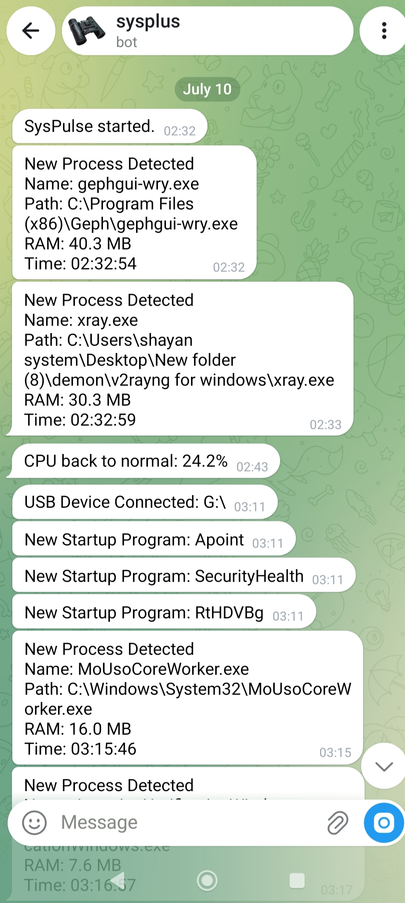

# # SysPulse

SysPulse is a lightweight security monitor for Windows. It runs silently in the background and sends instant Telegram alerts when it detects unusual system activity.

## Overview
Are you worried about hidden programs, malware, or unauthorized USB access on your server? SysPulse watches your system 24/7 and notifies you immediately when something unusual happens.

It is designed to be resource-efficient, using less than 30MB of RAM. It only monitors system metadata and processes; it does not read, access, or upload any of your personal files.

## Screenshots

## Features
- Detects new or unknown processes and logs their full file paths.
- Sends immediate alerts when a USB drive is connected.
- Monitors Windows Defender status and alerts if it is disabled.
- Tracks CPU, RAM, and Disk usage anomalies.
- Sends optional daily security summaries to your phone.

## Pricing
- Price: $39 (One-time payment, lifetime license)
- Payment: Crypto (USDT / USDC)
- A detailed setup guide is included inside the downloaded ZIP file.

## How to Use
1. Purchase a license and download the package.
2. Open `config.ini` and enter your Telegram Bot Token and License Key.
3. Run `Start_SysPulse.bat` to begin monitoring.
4. Use `Stop_SysPulse.bat` to safely terminate the application.

## Links
- Official Website: https://syspulse20.netlify.app
- Purchase: [(https://phantom.sellix.cx/p/syspulse-5)]

---
Built with Python. Made for SysAdmins, by a SysAdmin.
