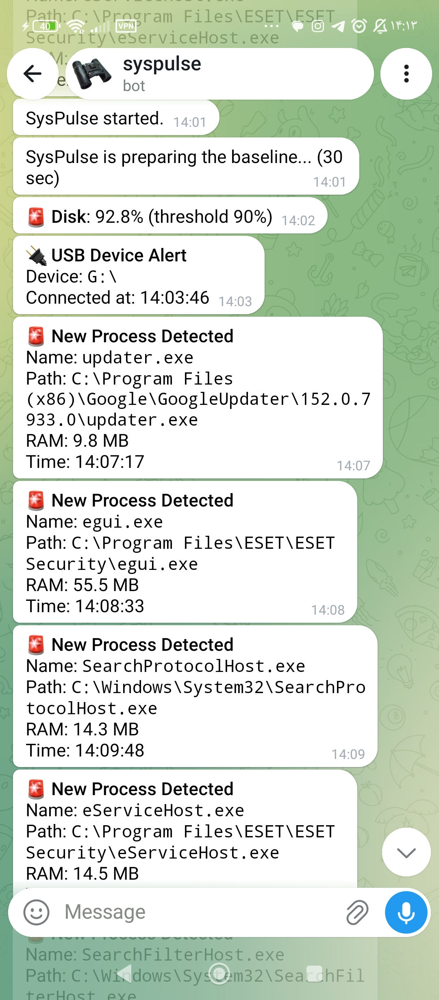
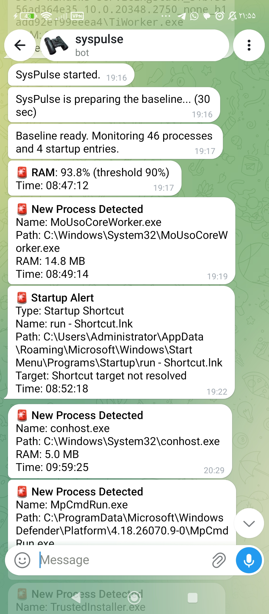

# SysPulse

A lightweight Windows security monitor that sends you instant Telegram alerts.

SysPulse sits quietly in the background of your Windows PC. It doesn't bother you, doesn't scan your files, and doesn't eat up your RAM. The moment something unusual happens, you know about it — straight to your phone.

*💡 **Kept lean on purpose:***

SysPulse is not a bloated security suite. It focuses on a few critical events and sends them straight to your phone. No feature creep, no cloud dashboards — just a quiet, dependable watchman.

We believe a security tool should be invisible when you don't need it and responsive when you do. That's why SysPulse typically uses around **12–25 MB of RAM** and focuses on monitoring features that provide useful visibility into your Windows system.

No bloat, no ads, no distractions. Just quiet, reliable monitoring.

Still here. Still silent. Still watching.

---

## What it actually does

- Detects new processes and shows their full file paths
- Detects USB drives being plugged in or removed
- Monitors CPU, RAM, and Disk usage
- Monitors startup activity and detects changes
- Sends Telegram notifications for monitored events
- Keeps monitoring locally even when there is no internet connection

No cloud dashboard. No unnecessary complexity. Just useful system activity alerts delivered to Telegram.

---

## Where it fits

Think of SysPulse as a lightweight Windows system activity monitor with a security-focused approach.

Something new runs on your PC? You'll know.

A USB device is connected? You'll receive an alert.

Startup activity changes? SysPulse can notify you.

CPU, RAM, or Disk usage becomes unusually high? You can be alerted.

The whole thing is designed to stay lightweight, typically using around **12–25 MB of RAM**.

SysPulse is not designed to replace antivirus software. Instead, it provides additional visibility into system activity alongside your existing security tools.

---

## Screenshots

| SysPulse Running | Telegram Alert |
|------------------|----------------|
|  |  |

*(Click to enlarge)*

---

## SysPulse vs Traditional Antivirus

SysPulse and traditional antivirus software serve different primary purposes.

| Feature | SysPulse | Traditional Antivirus |
|---------|----------|----------------------|
| Primary focus | Windows system activity monitoring | Malware detection and protection |
| RAM Usage | Typically ~12–25 MB | Usually higher |
| Telegram Alerts | ✅ Built-in | ❌ Not a standard feature |
| Process Monitoring | ✅ Full path + name | ⚠️ Primarily security-focused |
| USB Event Monitoring | ✅ Dedicated alerts | ⚠️ Available in some products |
| Startup Monitoring | ✅ Detects startup changes | ⚠️ Varies by product |
| Configuration | Simple `config.ini` | Usually more complex |

SysPulse is intended to complement, not replace, your antivirus or other security software.

---

## SysPulse vs. Process Explorer

We get asked this a lot.

The short answer:

**Process Explorer is your microscope. SysPulse is your guard dog.**

Process Explorer is excellent for manually inspecting processes and system activity.

SysPulse is designed for continuous background monitoring and notifications when selected system events occur.

They can work well together.

Read the full comparison on [Dev.to](https://dev.to/darkssel/syspulse-vs-process-explorer-two-windows-monitoring-tools-two-completely-different-philosophies-70l).

---

## How to use it

1. Download the package from the [official website](https://syspulse.pro).
2. Open `config.ini` and enter your Telegram bot token, chat ID, and license key. A setup guide is included in the download.
3. Run `Run.bat`.
4. To stop SysPulse, run `Kill.bat`.

No Python installation is required.

Everything is compiled into a single `.exe`.

---

## License & Activation

- One license, one machine (HWID-locked).
- Activates automatically the first time you run it with your key.
- Once activated, the key can't be used elsewhere.
- Moving to a new PC? Contact [support](mailto:darkssel@proton.me) and we'll help you with the process.

---

## Privacy

SysPulse is designed to monitor system metadata rather than personal files.

It monitors information such as:

- Process names and executable paths
- CPU, RAM, and Disk usage
- Startup activity
- USB events

SysPulse does not inspect your personal files or upload monitored system activity to a cloud dashboard.

Events are logged locally in a `syspulse.log` file.

SysPulse can continue monitoring locally even when your PC has no internet connection. Internet access is only required when SysPulse needs to send Telegram notifications.

Your Telegram alerts are sent directly to Telegram over HTTPS.

---

## The story behind it

If you're curious about why and how I built this thing, I wrote a technical breakdown on Dev.to:

[I built a Windows security monitor that uses less RAM than your browser](https://dev.to/darkssel/i-built-a-windows-security-monitor-that-uses-less-ram-than-your-browser-2kb1)

---

## Links

- Website: [syspulse.pro](https://syspulse.pro)
- Product Hunt: [SysPulse on Product Hunt](https://www.producthunt.com/products/syspulse)
- Support: [darkssel@proton.me](mailto:darkssel@proton.me)

---

*Made by Darkssel, a solo dev who wanted a quieter PC.*
